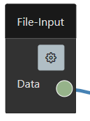

# File-Input

The file input allows to load local files from the computer. `squishy` used for this the file upload locally and allows to load files as `string` or `ArrayBuffer`. 
Additionally some upload and filer can be configured.

 

 ## Properties

Following `file-input` properties can be set:

<dl>
  <dt><b>Name</b></dt>
  <dd>The name of the `File-Input` block.</dd>

  <dt><b>Mode</b></dt>
  <dd><code>binary</code> or <code>text</code> for load the content of the file as <code>ArrayBuffer</code> or <code>string</code>.</dd>

  <dt><b>Encoding</b></dt>
  <dd>defining the file encoding for loading as a <code>string</code>.</dd>

  <dt><b>Accept</b></dt>
  <dd>filter the file type.</dd>

  <dt><b>Multiple</b></dt>
  <dd>allow to choose more then one file, which means the `return` is a array of the content of each file.</dd>

  <dt><b>Extended Output</b></dt>
  <dd>extends the output data with the <code>File</code> and <code>content</code></dd>
</dl>

## Data

The type definition of the `return` data from the *File-Input* are:
```typescript
// without extended output and not multiple
data: string | ArrayBuffer
// extended output and not multiple
data: { file: File, content: string | ArrayBuffer}
// without extended output but multiple
data: (string | ArrayBuffer)[]
// extended output and multiple
data: { file: File, content: string | ArrayBuffer}[]
```
