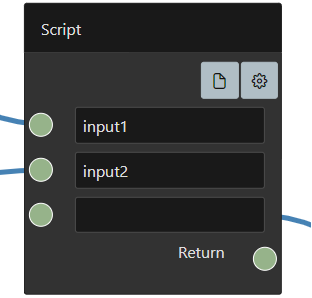

# Script

The script block allows to execute `Javascript` inside the browser. The incoming connections are defining script **variables** named like the input text, which can be used inside the script block. The script block alway needs to end with a ```return```. A the following a example script block are shown. 

 

Inside the script block the two variables `input1` and `input2` can be used. Checkout the script below.
```javascript
const x = input1 + input2
return x
```

## Properties

Following `script` properties can be set:

<dl>
  <dt><b>Name</b></dt>
  <dd>The name of the `Script` block.</dd>

</dl>

However this script blocks are the main feature of `squishy`, because with the custom code the inputs and the outputs are getting connected.

## Context

Additionally the script block is executed with a `context`. The `context` can be access via `this.*` anf gives many already implemented tools and plugins.
For more information checkout the `context` documentation.