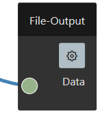

# File-Output

The file output allows to output the incoming ```data```, which means the ```data``` is pushed to a download file from the local page. However this gives the option to output ``data`` into the local computer file system.



## Properties

Following `file-output` properties can be set:

<dl>
  <dt><b>Name</b></dt>
  <dd>The name of the `File-Output` block.</dd>

  <dt><b>Filename</b></dt>
  <dd>The name of the download file from the local page.</dd>

</dl>

## Data

The input `data` is passed directly  into the download `Blob` and can be the following types:

```typescript
// input data type
data: ArrayBufferView | ArrayBuffer | Blob | string;
```
