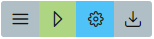

# Get-Started

The following shows a short tutorial about the usage of *squishy*.
The example connects two *input* nodes with a *script* node and forwards the return to a *output*.
Let's get started right away by using the [Squishy Playground](https://dayaftereh.github.io/squishy).

## Home

Open up the [Squishy Playground](https://dayaftereh.github.io/squishy) the home landing page is shown.

<p align="center">
    
</p>

This allows to run existing project or create new project.
For the tutorial a new project needs to be created, so click on the `Edit` button to continue.
Additionally, the documentation of *squishy* can be viewed.

## Projects-Manager

The **projects-manager** allows to create or remove projects.
Additionally, the manager allows to download or updated existing projects for sharing.
For some existing *squishy* projects checkout the examples.
> Currently all projects are stored in the browser [localStorage](https://developer.mozilla.org/de/docs/Web/API/Window/localStorage).

<p align="center">
    
</p>

For the tutorial a new project with the name `GetStarted` needs to be created.

<p align="center">
    
</p>

The new created project is now available in the project manager.
The project can be open with a double click on the project name from the list.

<p align="center">
    
</p>

## Project-Editor

The **project-editor** allows to add, connect or remove nodes and represents the **visual programming editor**.
With a right click the node add menu can be open and a node for creation can be added.

<p align="center">
    
</p>

For this tutorial two *File-Input*, one *Script* and one *File-Output* nodes are required.
The nodes needs to be connected and the *Script* node input **variables** named as the following.

<p align="center">
    
</p>

Now the **glue code** can be added to the *Script* node by clicking on .
This opens the **javascript** editor and allows to write custom **javascript** code.
> Remember to use autocomplete (`STRG`+`Space`) and checkout the extended libraries from *squishy*.

```javascript
// check if some input given
// if no file selected the File-Input forwards undefined
if(!input1 || !input2){
    throw new Error('no input given')
}

// return input2 if no input1
if(!input1){
    return input2
}

// return input1 if no input2
if(!input2){
    return input1
}

// concat both inputs
const result = input1 + input2

// return the concat result
return result
```

The **javascript** code is a simple string concatenation to concat two given files to one file.
> Remember the *script* node allows all **javascript** function from the [WebWorker](https://developer.mozilla.org/en-US/docs/Web/API/Web_Workers_API) context.

To execute the configured and programmed pipeline the **executor** is required.
The **executor** can be directly open for the current project by clicking the `play` button on .

## Executor

The **executor** allows to add the required input for the execution and executes the pipeline.
To execute the pipeline click the `Execute` button.

<p align="center">
    
</p>

While the execution is running a progress dialog is shown with a cancel button to stop the execution.

<p align="center">
    
</p>

By default the *File-Output* download is automatically started.
By clicking on the `pencil` button at the execution menu  the **project-editor** for the current project is opened.